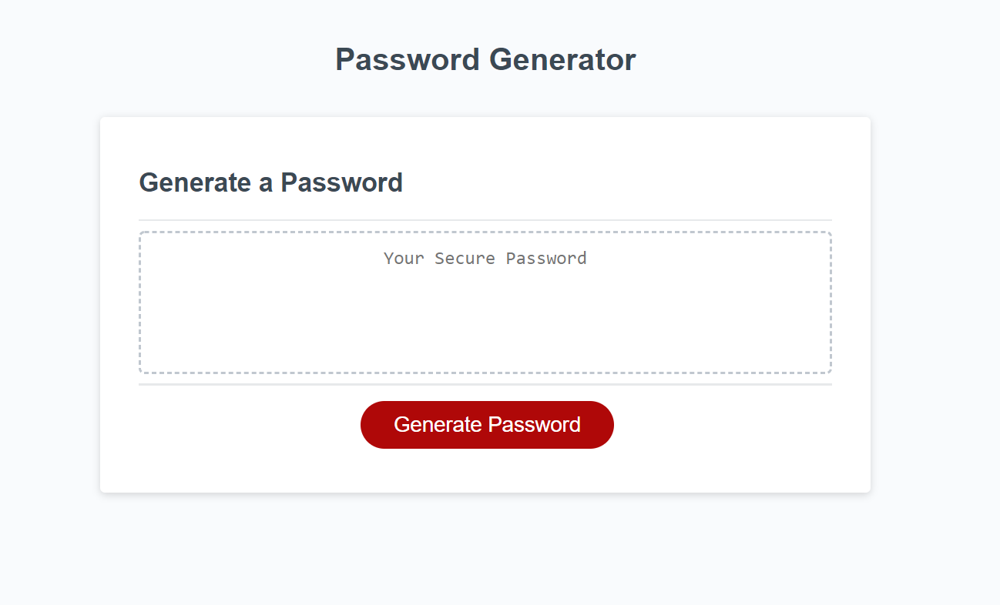

# password-generator

## Description

This password generator allows the user to create a series of random characters that may be used as a password. A password is most secure when it is comprised of random characters instead of key words or phrases from a user's life, and this password-generator makes the process of picking a password very simple.

## How to use this application
1. Click on the red "Generate Password" button.
2. Choose the number of characters you want your password to have. You may choose as few as 8 and as many as 128. Click 'OK' to submit.
3. Choose what kind of characters you would like your password to have. Click 'OK' for yes and 'cancel' for no. 
4. The generated password will appear above the red button. 

Access this application at https://abbynf.github.io/password-generator/

